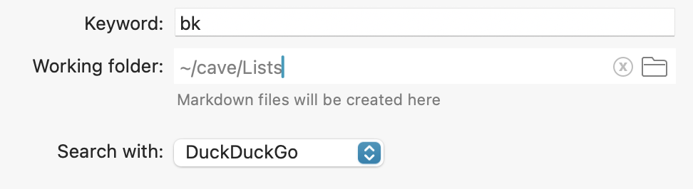

# Bookmarks
Workflow that helps you manage your links and quick search notes.

## Working folder
The main idea of Bookmarks is to have all your bookmarks locally on your computer and independent from any app.

After installing the workflow you should specify the working folder in workflow configuration:

Bookmarks will scan this folder and treat each .md file as a list. If for some reason you will delete Bookmarks or even Alfred, your once created lists will still stay with you.

## Usage
`bk` to see your lists.

`bkadd` to add item to one of the lists.

`bktab` to add the current active tab of the frontmost browser to the list.

### List modifiers
`⌘` to open list file in text editor.  
`⇧` to show checked items.  
`⌘⌥⇧` to delete list permanently.

## List items
There are two list item types – URLs and search queries. URLs are opened in the browser and plain text is used in web search.

You also can add checkboxes to list items. This is handy when you want to open your bookmarks only once. For example, you can use it for a list of articles that you need to go through. Checkbox items will be checked on opening and hidden from the list. If you still want to see them, hold ⇧ while picking a list.

You can convert plain items to checkbox items and vice versa by holding ⇧.

### List item modifiers
`⇧` to convert to checkbox item.  
`⌘⌥⇧` to delete item permanently.

Bookmarks will try to present URLs in a convenient way. If it's possible to get page's title (by fetching the page), it will be shown as an item title. You can also specify it manually by formatting link in Markdown format. For example adding `[Transport Museum](https://www.ltmuseum.co.uk/)` as an argument to `bkadd` command will later be represented with a title and URL:

Happy bookmarking!
